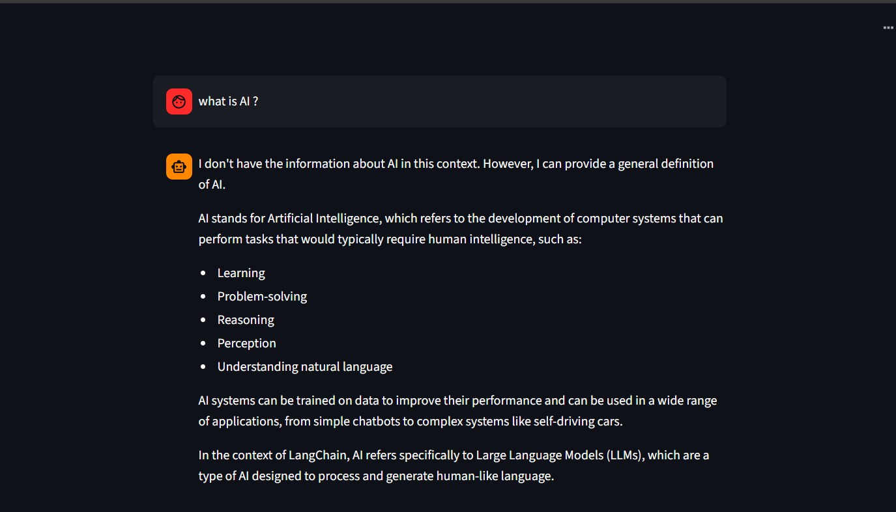

## 🤖 RAG Chatbot with LangChain & Groq

A Retrieval-Augmented Generation (RAG) Chatbot built with LangChain, Groq LLM, and Streamlit, capable of answering user queries using PDF documents as its knowledge base. This project demonstrates how to combine vector embeddings, document retrieval, and large language models to create a smart and interactive chatbot. 💡

 

# Features ✨ 

  💬 Interactive Chat Interface: Multi-turn conversation with chat history.

  📄 Document Knowledge Base: Answers questions based on uploaded PDFs.

  🧠 RAG Workflow: Combines vector retrieval and LLM generation for accurate responses.

  ⚡ Groq LLM Integration: High-quality, instant AI responses.

  🗂️ Session Management: Maintains conversation context across user interactions.

  🔍 Efficient Embeddings: Semantic search using HuggingFaceEmbeddings.

# Installation 🛠️

  Clone the repository:

    git clone https://github.com/your-username/AI_CHATBOT_RAG.git
    cd AI_CHATBOT_RAG

  Create a virtual environment:

    python -m venv venv

  Activate the environment:

  Windows:

    venv\Scripts\activate

  Mac/Linux:

    source venv/bin/activate

# Install dependencies:

    pip install -r requirements.txt

# Setup 🔑

  Add your Groq API key in a .env file at the root of the project:

    GROQ_API_KEY=your_groq_api_key_here

  Place your PDF documents in the project directory (example: 1.pdf).

# Usage 🚀

  Run the Streamlit app:

    streamlit run app.py

  Enter your queries in the chat input box.

  The chatbot retrieves relevant information from your PDF documents and responds using Groq LLM.

  Historical messages are displayed above for context.

# Code Overview ⚙️

  Vector Store Creation:
    Uses VectorstoreIndexCreator with HuggingFaceEmbeddings to create embeddings for PDF chunks.

  Retriever:
    Retrieves the top-k relevant document chunks using semantic search.

  LLM Chain:
    RetrievalQA chain sends retrieved chunks to the Groq model to generate accurate answers.

  Streamlit Interface:

   Stores conversation in st.session_state.messages.

   Displays chat messages using st.chat_message.

   Caches the vector store for efficiency with @st.cache_resource.

   

#Project Structure 📂

AI_CHATBOT_RAG/
│
├─ app.py                  # Main Streamlit application
├─ 1.pdf                   # Sample PDF knowledge base
├─ requirements.txt        # Python dependencies
├─ .env                    # API keys (not committed to Git)
└─ README.md               # Project documentation

# Dependencies

  Python 3.11+

  Streamlit

  LangChain

  langchain-groq

  langchain-community

  HuggingFace Transformers & Embeddings

  FAISS or other vector stores

# Future Improvements 💡

  Support multiple PDF documents or folders.

  Add file upload feature in Streamlit.

  Integrate Pinecone or Chroma for scalable vector storage.

  Enhance prompt templates for more accurate and context-aware answers.
